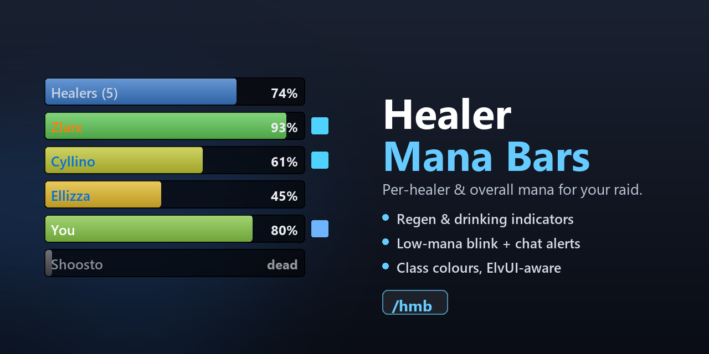

# Healer Mana Bars

Lightweight mana bars for your raid healers, for **WoW Classic Anniversary (TBC 2.5.x)**.

Shows one mana bar per healer plus an **overall** aggregate bar, so at a glance you
know whether the healing core has the mana to push — or needs a breather.

## Features

- **Per-healer + overall bars.** Healers are detected by their assigned raid role.
  Or show **just the overall bar** when you only want the raid-wide picture.
- **Regen & drinking indicators.** A small icon appears next to a healer who is
  under **Innervate**, **Mana Spring Totem**, or **Mana Tide Totem**, or who is
  **drinking**. (Mana Tide applies no buff aura, so it's read from the combat
  log — which only sees healers near you.)
- **Click to interact.** Left-click a healer's bar to **target** them; **right-click
  casts a spell of your choice** on them (defaults to **Innervate** for druids,
  blank otherwise). Configure or disable both in the *Interaction* options. (Bars
  are clickable while locked; unlock to drag.)
- **Low-mana alerts.** When the overall healer mana drops below a configurable
  threshold you can:
  - blink the overall bar red,
  - get a local raid-warning banner + sound (only you), and/or
  - announce `Healer mana below X%` to Party / Raid / Raid Warning. (Say and
    Yell are blocked for automated messages by the client, so the auto-alert
    can't use them.)
- **Dead healers** can be hidden, or greyed out and sunk to the bottom — and are
  kept out of the overall average either way.
- **Shapeshift-aware.** A raid druid in **Bear** or **Cat** form doesn't report
  mana to other players (the game only sends their active Rage/Energy), so rather
  than show a misleading 0% their bar is greyed with a form icon and left out of
  the overall average. They're still counted as a present healer. Toggle: **Mark
  shapeshifted druids** (General tab, on by default). Your own druid always shows
  real mana while shifted.
- **Fully configurable look.** Bar colour (class / static / green→red gradient),
  width, height, spacing, grow direction (up/down), bar texture, font & size, and
  overall / background opacity. Names are always class-coloured.
- **Per-element layout** — independently place the name (left/right), the % value
  (left/right/hidden), the status icons (left/right), and the fill direction
  (left→right or right→left). Mirror everything for a cluster docked on the
  **right** of your screen so the icons don't overflow and the bar drains toward
  the edge.
- **LibSharedMedia** aware — your shared textures and fonts show up in the lists.
- **ElvUI** option to borrow ElvUI's texture and font so the bars blend in.
- **Movable** — unlock to drag the cluster anywhere.
- **Per-context visibility** — choose where the bars appear: raid, party, or
  always (even solo). Hidden by default when solo; when shown solo it collapses
  to a single bar tracking your own mana. Always hidden in arenas and
  battlegrounds, since no healer roles are assigned there.
- **Test mode** to tune everything solo. It even includes **your own character**
  live (real name and mana), so what you configure is what you'll see in a raid.

## Usage

Open the options with **`/hmb`** (or via *Interface → AddOns → Healer Mana Bars*).

| Command | Action |
| --- | --- |
| `/hmb` | open the options panel |
| `/hmb lock` / `/hmb unlock` | toggle dragging |
| `/hmb test` | toggle test mode |
| `/hmb up` / `/hmb down` | growth direction |
| `/hmb reset` | reset position to the top-left |
| `/hmb status` | print diagnostics (handy for bug reports) |

## Interacting with the bars

While the cluster is **locked** (normal play), each individual healer bar is a
clickable unit button:

- **Left-click** — target that healer.
- **Right-click** — cast your configured spell on that healer.

Set the right-click spell under the **Interaction** options — any spell name
(e.g. *Innervate* for druids, *Power Infusion* for priests). The spell's icon
appears next to the field when the name resolves to a spell you can cast, so you
know it's correct. It defaults to *Innervate* for druids and is blank for
everyone else; leave it blank to disable right-click. Click-to-target can also be
turned off there.

Unlock (`/hmb unlock`) to drag the cluster; clicking is disabled while unlocked
so the drag works. The overall and test-mode bars don't map to a real unit, so
clicking them does nothing. Targeting and casting are protected actions that the
client won't let an addon change mid-combat, so if your roster shifts during a
fight the click mapping re-syncs the moment you leave combat.

## Healer detection

Healers are read from the **assigned raid role** (`UnitGroupRolesAssigned`).
Right-click a unit frame → **Role → Healer**, or set roles in the raid panel.
Players without the Healer role are not shown.

When you're **solo** there are no raid roles, so the addon shows a single bar
for your own mana (the overall bar) — handy with "Always show (even when solo)".

## Optional dependencies

- **LibSharedMedia-3.0** — if present (e.g. provided by another addon), its
  texture and font registries replace the small built-in lists.
- **ElvUI** — enables the "Use ElvUI texture + font" option.

Neither is required; the addon ships no libraries and works standalone.

## Notes

- Status icons sit just past the right edge of each bar, so leave a little room
  on that side when positioning the cluster against the screen edge.
- A bar will only update for a healer who is online and in range; out-of-range
  members may briefly read stale values until they come back into range.

## Feedback

Bug reports and suggestions are welcome on the CurseForge project page. Please
include the output of `/hmb status` when reporting display issues.

## License

Released under the MIT License.
